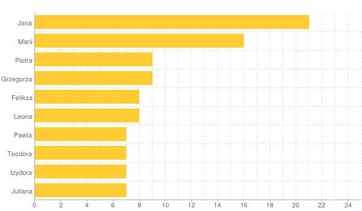
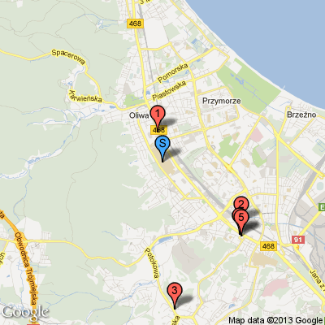
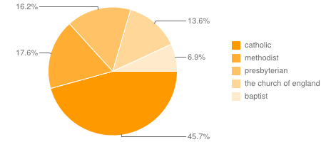

### *Jakub Martin, 186408*
---

# Google Refine 

### *Lista lotów programu Apollo*

#### Przygotowania
* dane do pobrania z Wikipedii: http://en.wikipedia.org/w/index.php?title=Apollo_program&action=edit&section=28
* narzędzie Google Refine: https://code.google.com/p/google-refine/

#### Oczyszczanie danych
* import danych do programu (Line-based text files)
* usunięcie niepotrzebnych wierszy (Text Filter)
* oczyszczenie z wierszy z niepotrzebnych danych tak, żeby każda kolumna oddzielona była znkaiem | (Transform)
* mając kolejne kolumny oddzielone znakiem | możemy teraz dodawać kolumny (Add column based on this column) korzystając ze split i wybierać dane
* usuwamy początkową kolumnę
* eksportujemy

#### Przykładowe wynik
```json
{
  "Designation" : "Apollo 7",
  "Date" : "Oct. 11-22, 1968",
  "Description" : "Earth orbital demonstration of Block II CSM, launched on Saturn IB. 
    First live television publicly broadcast from a manned mission",
  "Crew" : "Wally Schirra, Walt Cunningham, Donn Eisele"
}
```
Cały plik: [datarefine.json](/data/json/jmartin/datarefine.json)

#Agregacje

## Agregacje lokalnie

### *db.imieniny*

#### Przygotowania

* pobranie danych

```sh
wget https://raw.github.com/nosql/data-refine/master/data/csv/imieniny.csv
```

* import do mongo

```sh
mongoimport --drop --headerline --type csv --collection imieniny < imieniny.csv
```

* zmiana formatu danych w rubym

```ruby
require 'mongo'
include Mongo

db = MongoClient.new("localhost", 27017, w: 1, wtimeout: 200, j: true).db("test")
coll = db.collection("imieniny")

coll.find({}, {snapshot: true}).each do |doc|
  doc["names"] = doc["names"].split(" ")
  doc["date"] = "%02d/%02d" % [doc["day"], doc["month"]]
  doc.delete("day") ; doc.delete("month")
  coll.save(doc)
end
```

#### Agregacje:

* **ile osób musi świętować jednocześnie sylwester i swoje imieniny?**

```js
db.imieniny.aggregate(
  { $project: { names: 1, date : 2} },
  { $unwind: "$names" },
  { $group: { _id : "$date", count: {$sum : 1}} },
  { $match: {_id: "31/12"} }
)
```

Wynik: [aggr1.json](/data/json/jmartin/aggr1.json)

* **10 osób z największą liczbą imienin**

```js
db.imieniny.aggregate(
  { $project: { _id : 0, names: 1, date : 1} },
  { $unwind: "$names" },
  { $group: { _id : "$names", count: {$sum : 1}} },
  { $sort: {count: -1} },
  { $limit : 10 }
)
```

Wynik: [aggr1.json](/data/json/jmartin/aggr2.json)



### *db.poland*

#### Przygotowania

* przygotowujemy na localu dane zgodnie z [osm.md](/docs/osm.md).

* w konsoli mongo wpisujemy:

```js
db.poland.ensureIndex({ 'location.coordinates' : '2d'})
```

#### Agregacje:

* **5 restauracji niedaleko UG (db.poland)**

```js
db.poland.aggregate(
  { "$geoNear" : { near: [18.573622,54.395732] , distanceField: 'distance', limit: 5, 
    query : { 'tags.amenity' : "restaurant" } }},
  { "$project" : {_id: 0, location: '$location.coordinates', tags: '$tags', distance: '$distance'}}
)
```

Wynik: [aggr4.json](/data/json/jmartin/aggr4.json)

Skrypt Ruby: [jmartin.rb](/scripts/ruby/jmartin.rb)



## Agregacje z wykorzystaniem maszyny wirtualnej na UG

#### Przygotowania

* łączymy się z bazą

```sh
mongo --username student --password sesja2013 153.19.1.202/test
```

#### Agregacje:

* **porównanie ilości wierzących pięciu największych religii w Wielkiej Brytani (db.census1881)**

```js
db.census1881.aggregate(
  { $project: { _id : 0, religion: 1} },
  { $group: { _id : "$religion", count: {$sum : 1}} },
  { $sort: {count: -1} },
  { $limit : 5 }
)
```

Wynik: [aggr3.json](/data/json/jmartin/aggr3.json)

 
